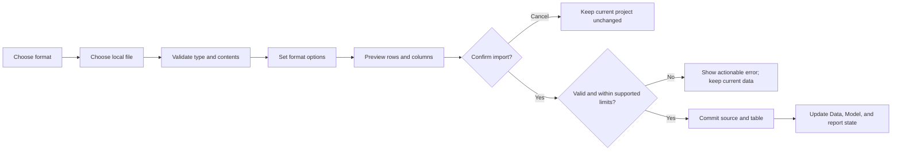

# Functionality Implementation Roadmap

This is a local data and report workflow roadmap. The bounded **Home → Get data → File** import flow is implemented; finish its lifecycle verification before completing the rest of Home and proceeding through the other ribbon tabs. Build and finish one user workflow at a time. It does not promise that every connector or cloud command will become active.

Keep the established ribbon and Visualizations pane layout while adding behavior. Excel import remains supported. Existing connector entries can remain visible with their current staged/unavailable status; this roadmap does not add service integrations. Copilot and Power Automate are excluded throughout. A control should look available only when its workflow works end to end; apply that rule in the ribbon, menus, picker, and shortcut surfaces.

## 1. Current baseline

These items already work in the current app:

- Import CSV, Excel, flat JSON, and regular-record XML through a bounded preview-and-confirm dialog. The project format is now v2 and stores the active source and parser options; v1 projects migrate on load and upgrade on explicit save.
- Show the loaded source in Data and Model, with a 500-row Data view preview; refresh a linked file; save and reopen `.npa` projects.
- Use New/Open/Save/Save As, add a report page, switch the supported revenue charts between bar/column/line, and use the core pane and zoom controls.

These visible entries are staged or incomplete:

- Folder, PDF, and Parquet file import.
- Enter data, sample data, and Transform data.
- Generic visual authoring, text boxes, shapes, buttons, calculations, relationships, and most Optimize actions.
- Database and online/service connectors. Their presence in a catalog or ribbon does not mean they connect.

The current runtime loads one active table at a time. `.npa` files link to external data paths and store model metadata; they do not embed imported rows. The Data view displays up to 500 rows; import preview displays up to 100 while reporting full counts. The parser enforces separate input, row, column, cell, and expanded-workbook limits.

## 2. Define the file import behavior

The **File connector category** under **Home → Get data** is the first implementation milestone. Its implementation is in place; the lifecycle gate below remains. It is separate from **Insert → More visuals → From my files**, which is for visual assets.

Use this flow for each supported tabular format:

Do not change the loaded project while a file is being selected, configured, or previewed. Parse into a temporary candidate to build the preview, but do not commit it yet. The final import confirmation should include a warning that the current table will be replaced when one is loaded; do not ask for replacement a second time. Commit only after validation and confirmation. Cancel, unsupported types, permission errors, corrupt files, empty inputs, and parse failures must preserve the current rows, source, model, report values, and dirty state.

### Step 2.1 — Make file routing explicit

**Implemented:** all file entry points use an explicit extension/type allowlist. Unknown extensions, wrong file contents, and legacy `.xls` show an error and never reach the Excel parser.

Keep current support labeled accurately while work proceeds:

| Format | Current state | From Files v1 behavior |
|---|---|---|
| Text/CSV | Implemented | Preview delimiter, encoding, and header choice; preserve quoted separators and newlines; normalize BOM, blank/duplicate headers, and ragged rows predictably. |
| Excel `.xlsx` / `.xlsm` | Implemented | Choose one worksheet and its header row. Use cached formula values; formulas are not recalculated and missing cached results import as blank with a notice. |
| JSON | Implemented | Accept a non-empty top-level array of flat objects with scalar values and deterministic first-seen columns; reject nested values and duplicate object keys. |
| XML | Implemented | Accept one repeated direct-child record collection with identical ordered scalar child fields; reject mixed, irregular, nested, attributed, or ambiguous structures. |
| Parquet | Catalog entry only | Defer until reader dependency, packaging, and number/date/null type behavior are decided. |
| Folder | Catalog entry only | Defer until combine rules, schema mismatch handling, provenance, refresh, and partial failure behavior are defined. |
| PDF | Catalog entry only | Treat as a separate document/table extraction feature; define page selection, extraction confidence, and OCR scope first. |
| Legacy `.xls` | Unsupported | Add only after choosing and packaging a parser deliberately. |

The catalog enables CSV, Excel, JSON, and XML because each now has a parser and the shared preview/confirmation flow. Keep Folder, PDF, Parquet, database, and service connectors visibly unavailable until their complete workflows are implemented.

All four formats are bounded to 10 MiB input files, 100,000 rows, 512 columns, and 500,000 cells; Excel packages also have an 80 MiB total uncompressed limit. These defensive limits are not minimum-Mac performance benchmarks. Larger inputs are rejected rather than silently truncated.

### Step 2.2 — Build the common preview and commit path

1. **Implemented:** route every supported selected format through one parser. The dialog exposes CSV delimiter/encoding/header settings and Excel worksheet/header settings; JSON/XML use their bounded shapes.
2. **Implemented:** show a bounded preview and accurate row/column counts; normalize headers; use consistent blank-value rules.
3. **Implemented:** validate the full candidate and report file-specific parser errors before replacing the active table.
4. **Implemented:** include the replacement warning in the final Import data action when a table is loaded.
5. **Implemented:** commit the active source, parser options, model table, Data view, fields, and supported report summaries after confirmation.

V1 still has one active tabular table; it does not imply joins or simultaneous loaded tables. **Implemented:** `.npa` v2 persists an explicit active source and parser options. V1 migration selects the first CSV/Excel source as before, then the next explicit save writes v2. Keep inactive metadata separate from the active table and preserve path behavior for Save As, missing files, and re-import.

Before calling imports ready for general file sizes, measure a practical supported limit on the minimum supported Mac. The current caps are defensive and are not that benchmark. If supported inputs block the window, move parsing off the UI thread and show progress/cancel. Do not silently truncate imported data; 500 rows is only the current Data view preview cap.

### Step 2.3 — Pass the From Files v1 gate

Complete these checks separately for CSV, Excel, JSON, and XML before beginning the Home feature work:

1. Verify representative files preview the same candidate rows/columns that the confirmation commits; confirm visibility in Data and Model.
2. Extend edge checks for CSV BOM/quoting/headers/ragged rows; multiple/blank Excel sheets, dates, booleans, and cached/missing formulas; and supported/rejected JSON/XML shapes. Parser unit coverage exists for the bounded shapes; workbook dates/formula edge fixtures remain to verify.
3. Verify save, close, reopen, refresh, parser-option restoration, and Save As for relative and absolute paths.
4. Verify missing files, re-import, corrupt/empty files, unknown suffixes, permissions, and size-limit rejection.
5. Verify cancellation or any failure leaves the last good source, table, report, and dirty state unchanged.
6. Check every file UI entry point and keep all deferred formats visibly unavailable.

**Verification status:** 31 automated tests pass, covering CSV/Excel/JSON/XML parser behavior, file-catalog routing, preview, commit and project reopen for all four formats, CSV refresh and failed-refresh preservation, deeply nested JSON error handling on refresh and project open, and v1 project migration. Python compilation and an offscreen Qt Quick startup check also pass. The remaining lifecycle gate includes Save As with relative and absolute links, missing-file recovery, and Excel date/boolean/formula fixtures. The current input limits also need a minimum-Mac performance check. The format list is deliberately bounded; this does not claim every file-related catalog entry works.

## 3. Complete Home

Implement Home in this order so each step reuses the tested import path.

### Step 3.1 — Finish Home’s data commands

1. **Implemented:** route **Get data**, CSV/Excel shortcuts, and file catalog selection through the common importer with format-specific status.
2. Make **Recent sources** a real recent-file list with deterministic reopen behavior. It currently exposes the active source and refreshes it using saved options. Keep future recent history distinct from the one active table.
3. Make **Refresh** dispatch by the active source kind and preserve last-good data when a refresh fails.
4. Add **Enter data** as an editable, validated grid. Add **Sample data** with a deterministic built-in dataset.
5. Before enabling Enter/Sample data, define how inline rows and columns are stored in `.npa`. Version 2 stores source paths and table metadata, not imported rows. Inline sources replace the active table like file imports; Refresh is unavailable for them.

### Step 3.2 — Add data transformation

Start with a small local transformation workflow: rename/remove columns, choose data types, filter/sort rows, and remove empty/error rows. Show a preview and a list of applied steps. Save those steps with the project and replay them on refresh. Add operations one at a time and keep the source file unchanged.

Do not mark **Transform data** active until opening, applying, canceling, saving, reopening, and refreshing a transformation all behave correctly.

### Step 3.3 — Finish Home report actions

1. Replace fixed-only **New visual** behavior with a visual chooser that uses imported fields. Start with the already supported bar, column, and line charts.
2. Add per-visual field wells, selection, and edit/remove behavior. Keep missing or incompatible fields visible as a clear empty state.
3. Implement clipboard actions and Format painter against selected report objects.
4. Add text boxes and any remaining local authoring commands. Defer marketplace or service backed visual installs.
5. Add measures and quick calculations after column types and aggregation rules are stable; persist expressions and results with the model.

Sensitivity labeling, cloud publishing/sharing, and service connectors are outside this roadmap and remain unavailable. Do not add Copilot or Power Automate back through another ribbon surface.

**Home is done** when each in-scope local Home command completes its real workflow, saves/reopens where applicable, and has a clear disabled/unavailable state otherwise.

## 4. Continue through the remaining tabs and views

The ribbon tabs are File, Home, Insert, Modeling, View, Optimize, and Help. Report, Data, and Model are workspace views, not ribbon tabs. File/project save and Help basics already work; extend them only where listed below.

### Step 4.1 — Insert

Build on the saved report-object model from Home. Preserve the working Add page action, then complete page rename/delete and visual lifecycle. Add selectable/resizable text boxes, images, shapes, and buttons. Add More visuals only after a local install/import and compatibility story exists. Every object should remain selectable and editable after save/reopen.

### Step 4.2 — Data and Model workspace views

Improve the Data view for field search, column/type inspection, and reliable table preview. Then expand the project model to multiple tables if relationships are in scope. The current one-active-table limit cannot support meaningful relationships; decide source IDs, active table selection, missing-file behavior, and any project format migration before enabling them.

### Step 4.3 — Modeling

Add model table/column properties and type correction first. Add relationship creation and validation after multi-table behavior. Add date tables, calculated columns/tables, DAX measures, parameters, and security only after the type system, formula behavior, persistence, and error reporting are defined.

### Step 4.4 — View

Keep existing pane toggles, reset layout, and zoom behavior stable. Add themes, gridlines, snap-to-grid, object locking, mobile layout, and other page options only when the canvas supports and persists them. Preserve the reference side panel geometry and prevent ribbon/pane text or icons from clipping.

### Step 4.5 — Optimize

After visual rendering and data refresh are stable, add visual query pause/refresh, performance analysis, optimization presets, and slicer apply behavior. Show measurements and errors from real work; do not make these controls decorative.

### Step 4.6 — File and Help follow-up

Keep project New/Open/Save/Save As and the current About, shortcuts, and project-format help working. Decide local export formats separately. External publishing/sharing and service connectors are outside this roadmap and remain unavailable.

## 5. Implementation touchpoints

Use the existing files first; add modules only when a real responsibility needs its own home:

- `analytics_studio/data_sources.py` — supported formats and honest catalog status.
- `analytics_studio/qml/GetDataDialog.qml` — file selection, format options, preview, and confirmation.
- `analytics_studio/controller.py` — strict dispatch, parser calls, staged commit, recent/refresh behavior.
- `analytics_studio/project.py` and `docs/project-format.md` — active source identity, parser options, and any schema migration.
- `analytics_studio/qml/Main.qml` and `analytics_studio/qml/RibbonPopupMenu.qml` — route every ribbon/menu shortcut to the same real action or a clearly unavailable state.

Add parser tests and workflow tests as each feature is implemented.
