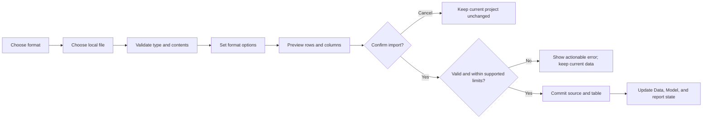

# Functionality Implementation Roadmap

This is a local data and report workflow roadmap. The File tab and supported local workflows in Home are implemented in code; each workflow's runtime acceptance status is tracked below. Build and verify one user workflow at a time; this does not promise that every connector or cloud command will become active.

Keep the established ribbon and Visualizations pane layout while adding behavior. Excel import remains supported. Service-only controls must be disabled with an honest reason; this roadmap does not add service integrations. Copilot and Power Automate are excluded throughout. A control should look available only when its workflow works end to end; apply that rule in the ribbon, menus, picker, and shortcut surfaces.

## 1. Current baseline

These items already work in the current app:

- Import CSV, Excel, flat JSON, regular-record XML, and single-file Parquet through one bounded preview-and-confirm dialog. Connect read-only to local SQLite files, select a table or view, and preview before import. Connect anonymously to HTTPS OData v4 service roots, select entity sets, preview scalar rows, and follow bounded same-origin pagination; use Web for anonymous HTTPS CSV, JSON, XML, Excel, Parquet, and static HTML tables. CSV, Excel, JSON, XML, single-file Parquet, Folder, legacy XLS, and local SQLite workflows have passed scoped lifecycle acceptance. SQL Server, OData, and Web have mocked/dialog/project lifecycle coverage; acceptance against live services remains pending. Recent Sources restores single-file options; Folder sources reopen their saved combine recipe in the separate folder dialog.
- Enter and paste local table data, load deterministic sample data, apply ordered local transformations, define local DAX measures, calculated columns, bounded calculated tables, and generated calendar tables, and save/reopen them in v66 `.npa` projects. Inline data is embedded; file rows remain linked externally.
- Add several local tables to one project, switch the active table, refresh only its linked file or folder, re-import a linked path into its existing table, and remove a table without deleting its external source. Controller lifecycle acceptance covers these workflows and Save As/missing-source cases; an offscreen QML smoke loaded the Data view with multiple tables, with manual selector interaction still pending.
- Show the loaded source in Data and Model, with a 500-row Data view preview; refresh linked files and replay their steps; export the active transformed table as CSV.
- Use New/Open/Save/Save As, add a report page, switch supported revenue charts between bar/column/line, and use the core pane and zoom controls.

These visible entries are staged or incomplete:

- PDF import. Folder combine, Parquet, and legacy `.xls` are implemented; preview/import/save/reopen/refresh lifecycle acceptance has passed, with broader file edge cases still open.
- Clipboard object editing, Format Painter, generic visual authoring, text boxes, shapes, buttons, broader filter-path analysis, broad cross-table DAX, and most Optimize actions. Top N, report-level filters, and their save/reopen lifecycle have passed acceptance.
- Online/service connectors beyond OData Feed and the bounded anonymous HTTPS Web subset. SQLite, SQL Server, OData Feed, and Web are implemented source choices; other catalog entries remain informational.

The runtime loads supported sources independently and uses one selected table at a time in Data and built-in report summaries. Local measures, calculated columns, bounded `DISTINCT` calculated tables, and generated calendar tables are implemented; `TOTALYTD` supports default calendar years and ASCII M/D fiscal year ends; `TOTALQTD`, `TOTALMTD`, marked-column `DATEADD` and `SAMEPERIODLASTYEAR`, and calendar/fiscal `DATESYTD`, `DATESQTD`, `DATESMTD`, `DATESBETWEEN`, `DATESINPERIOD`, `PREVIOUSYEAR`, `PREVIOUSQUARTER`, and `PREVIOUSMONTH` in their local CALCULATE filter forms pass measure lifecycle acceptance. Boolean `CALCULATE` filters support typed single-column comparisons, AND/OR/NOT composition, multiple ANDed arguments, same-column replacement, and `KEEPFILTERS` intersection, with save/reopen and changed-source baseline acceptance. Final review fixes for `BLANK()` coercion, nested date-context preservation, and qualified column names matching measures passed the 78-test focused run and 313-test full suite at that increment. Table-valued `FILTER` now passes its bounded current-visible-input, whole-row correlation, relationship preservation, nested-context restoration, and changed-source acceptance; text comparisons remain case-sensitive in this local evaluator. Saved page-, visual-, and report-level filters are implemented; supported measure and filter evaluation follows active relationships. `.npa` v66 links file and SQLite sources to external paths, stores pathless SQL Server connection/object metadata with a Keychain reference and OData/Web URL and navigation metadata without credentials, embeds inline tables, and stores source-specific parser options, query groups, transformation steps, saved append/merge/calculated-table/calendar query dependencies, page and visual filters, and relationship definitions alongside model metadata. The Data view displays up to 500 rows; import preview displays up to 100 while reporting full counts. The parser enforces separate input, row, column, cell, and expanded-workbook limits. Relationship authoring, measure filter propagation, and page/visual/report filter lifecycle checks pass. Visual Top N and report-level filter lifecycle checks also pass.

## 2. Define the file import behavior

The **File connector category** under **Home → Get data** is the first implementation milestone. Its implementation is in place; the lifecycle gate below remains. It is separate from **Insert → More visuals → From my files**, which is for visual assets.

Use this flow for each supported tabular format:

Do not change the loaded project while a file is being selected, configured, or previewed. Parse into a temporary candidate to build the preview, but do not commit it yet. A new file adds a table; re-importing an already linked path replaces that table and its saved transform steps after warning in the confirmation dialog. Commit only after validation and confirmation. Cancel, unsupported types, permission errors, corrupt files, empty inputs, and parse failures must preserve existing tables, model, report values, and dirty state.

### Step 2.1 — Make file routing explicit

**Implemented:** all file entry points use an explicit extension/type allowlist. Unknown extensions, wrong file contents, and legacy `.xls` show an error and never reach the Excel parser.

Keep current support labeled accurately while work proceeds:

| Format | Current state | From Files v1 behavior |
|---|---|---|
| Text/CSV | Implemented | Preview delimiter, encoding, and header choice; preserve quoted separators and newlines; normalize BOM, blank/duplicate headers, and ragged rows predictably. |
| Excel `.xls` / `.xlsx` / `.xlsm` | Implemented subset; legacy `.xls` lifecycle accepted | Choose one worksheet and its header row. Formulas are not recalculated; stored formula results are imported when present. `.xls` dates use the workbook's 1900/1904 system; ambiguous or invalid date serials remain numeric. |
| JSON | Implemented | Accept a non-empty top-level array of flat objects with scalar values and deterministic first-seen columns; reject nested values and duplicate object keys. |
| XML | Implemented | Accept one repeated direct-child record collection with identical ordered scalar child fields; reject mixed, irregular, nested, attributed, or ambiguous structures. |
| Parquet | Implemented subset; lifecycle acceptance passed | Import one local `.parquet` file through the shared preview/commit flow using PyArrow. Flat scalar columns become text; nulls become blank; nested, binary, and non-finite numeric values are rejected. Limits: 10 MiB input, 80 MiB row-group uncompressed data, 80 MiB rendered UTF-8 result, 100,000 rows, 512 columns, and 500,000 cells. |
| Folder | Implemented subset; lifecycle acceptance passed | Combine filtered CSV, Excel, JSON, or XML files from one folder using a sample file; optionally include subfolders; require matching ordered schemas; optionally add `Source.Name` (on by default); save filters and sample parser options for refresh. Limits: 500 files, 100 MiB combined and 10 MiB per file. |
| PDF | Catalog entry only | Treat as a separate document/table extraction feature; define page selection, extraction confidence, and OCR scope first. |

The catalog enables CSV, Excel (`.xls`/`.xlsx`/`.xlsm`), JSON, XML, Folder, Parquet, local SQLite table/view import, and SQL Server table/view import over Microsoft's ODBC driver. Folder import has its own discovery, filtering, sample-options, schema-check, and combine-preview flow; Parquet and `.xls` are single-file workflows routed through the shared file preview. PDF, other database connectors, and service connectors remain visibly unavailable until their complete workflows are implemented.

The four baseline single-file formats are bounded to 10 MiB input files, 100,000 rows, 512 columns, and 500,000 cells; `.xlsx`/`.xlsm` packages also have an 80 MiB total uncompressed limit. Parquet adds row-group and rendered-text caps. Folder combine uses the per-file and table limits plus its aggregate caps. These are result limits, not a guarantee of peak process memory or minimum-Mac performance. Larger inputs are rejected rather than silently truncated.

### Step 2.2 — Build the common preview and commit path

1. **Implemented:** route every supported selected format through one parser. The dialog exposes CSV delimiter/encoding/header settings and Excel worksheet/header settings; JSON/XML use their bounded shapes, and Parquet uses the bounded batched reader.
2. **Implemented:** show a bounded preview and accurate row/column counts; normalize headers; use consistent blank-value rules.
3. **Implemented:** validate the full candidate and report file-specific parser errors before adding or replacing the target table.
4. **Implemented:** include a replacement warning when the selected file is already linked to a table.
5. **Implemented:** commit the source, parser options, model table, Data view, fields, and supported report summaries after confirmation.

The project can retain multiple independently loaded local, SQL Server, OData, or Web tables. Built-in report summaries use the selected table's rows, while saved page/visual conditions and qualified local measures can propagate through active relationships. `.npa` v66 supports linked file and SQLite, pathless SQL Server, OData Feed, and Web sources, inline, and derived append/merge/calculated-table/calendar query sources; it loads query dependencies in order, saves query definitions, flat group labels, and page/visual condition filters, retains source-specific parser options and ordered transformations, embeds inline rows, and rebases linked paths on Save As. Projects v1–v65 migrate to v66, preserving existing source and report data; explicit save writes v66.

Before calling imports ready for general file sizes, measure a practical supported limit on the minimum supported Mac. The current caps are defensive and are not that benchmark. If supported inputs block the window, move parsing off the UI thread and show progress/cancel. Do not silently truncate imported data; 500 rows is only the current Data view preview cap.

### Step 2.3 — From Files v1 gate

These checks are implemented and covered by automated tests for CSV, Excel, JSON, and XML:

1. Verify representative files preview the same candidate rows/columns that the confirmation commits; confirm visibility in Data and Model.
2. Extend edge checks for CSV BOM/quoting/headers/ragged rows; multiple/blank Excel sheets, dates, booleans, and cached/missing formulas; and supported/rejected JSON/XML shapes. Parser unit coverage exists for the bounded shapes; workbook dates/formula edge fixtures remain to verify.
3. Verify save, close, reopen, refresh, parser-option restoration, and Save As for relative and absolute paths.
4. Verify missing files, re-import, corrupt/empty files, unknown suffixes, permissions, and size-limit rejection.
5. Verify cancellation or any failure leaves the last good source, table, report, and dirty state unchanged.
6. Check every file UI entry point and keep all deferred formats visibly unavailable.

**Verification status:** see the current `TEST_RESULTS.md` artifact for the latest complete run. Additional manual checks remain for minimum-Mac performance and Excel date/boolean/formula fixtures. The format list is deliberately bounded; this does not claim every file-related catalog entry works.

## 3. Complete Home

The local Home and File workflows reuse the tested import path and project lifecycle.

### Step 3.1 — Finish Home’s data commands

1. **Done:** route Get data, CSV/Excel shortcuts, and the file catalog through the shared importer.
2. **Done:** Recent Sources is a bounded, deduplicated local history. Selecting a source reopens preview/confirmation; Refresh reloads only the active linked file.
3. **Done:** Refresh preserves the last good table and replays saved transform steps. It is unavailable for inline tables.
4. **Done:** Enter/Paste and deterministic Sample Data use validated pathless inline source records, stored in `.npa` v66.
5. **Done:** File Export writes the active transformed table as UTF-8 CSV. It does not alter the project.

### Step 3.2 — Add data transformation

The local Transform Data workflow supports rename/remove/keep columns, exact value replacement, first-delimiter splitting, extracting text before or after a chosen delimiter occurrence and text between delimiters, splitting at every delimiter into columns, split-by-position, and split-to-rows, merging selected columns with a separator, Fill Down/Fill Up on selected columns, Duplicate Column, Remove Blank Rows, Remove Top Rows, Remove Bottom Rows, Keep Top Rows, Keep Bottom Rows, Keep Range of Rows, Remove Alternate Rows, Add Index Column, Reorder Columns, Use First Row as Headers, Use Headers as First Row, Transpose Table, multi-key Group By with multiple aggregations, unpivot selected/other columns, Pivot column, safe custom-column formulas, Conditional Column rules, text trimming, Clean Text control-character removal, and locale-neutral Lowercase, Uppercase, and Capitalize Each Word conversions plus Reverse Text on Text-typed fields before non-text conversion, duplicate removal and retention by selected columns, multi-column sorting, text filtering with begins/ends and negated operators, inclusive numeric comparisons, advanced multi-column filters with AND/OR clauses, Is blank/Is not blank row filters, row filtering/sorting, and text/whole-number/decimal/boolean/date/date-time/time validation and normalization. Change Type Using Locale adds explicit-culture parsing for whole/decimal numbers and date/time values in Transform Data, with saved culture metadata and invariant normalized output. Custom formulas use a bounded M-style subset with field references, operators, conditional expressions, and selected Text, Number, and Date functions; results default to text and can be converted by a later step. Unpivot emits attribute/value rows for non-empty cells, can retain chosen columns, and stores configurable output names. Pivot derives columns from distinct attribute values, preserves all other fields as row keys, and offers no-aggregate, count, min/max, median, sum, and average modes. Duplicate key/category pairs are errors when aggregation is off; generated pivot columns default to text. It previews an editable ordered step list, saves it with the source, and replays it after parsing. The model saves per-column types in project format v66 while cell values remain serialized as normalized text in the current table model. Transpose Table turns data rows into columns and columns into rows, drops original column names, and creates sequential `Column1` headers; promoting the first output row remains a separate step. The Data view supports saved append queries, merge queries with six join kinds, flat named query groups, and separate Enable Load and Include in Report Refresh settings for each saved query. Query definitions, group names, and load/refresh settings persist by source ID; excluded query outputs remain available to downstream queries and queries replay on open/refresh. The source file is unchanged. This is a local Power Query-style step editor, not a general M language engine; the master functionality graph records 50/50 listed capabilities as passing lifecycle acceptance. The Transform Data QML command route also has offscreen acceptance for committing a step, saving/reopening, and replaying it after a source change. Conditional Column supports ordered clauses with literal or column-based comparisons and outputs, with a final Else. Fill Down and Fill Up copy the nearest non-empty value into blank strings on selected columns, leaving leading Fill Down blanks and trailing Fill Up blanks when no value exists in that direction. Remove Blank Rows drops rows only when every normalized cell is empty; whitespace-only cells remain. Remove Top Rows removes a selected number of rows from the beginning while preserving remaining order. Remove Bottom Rows removes a selected number from the end and preserves the preceding order. Keep Top Rows retains a selected number from the start and preserves their order. Keep Bottom Rows retains a selected number from the end in its original order. Keep Range of Rows retains a contiguous slice starting at a one-based row position. Remove Alternate Rows keeps earlier rows, then repeats a remove-count/keep-count pattern from a one-based starting row; one of those counts must be positive. Add Index Column appends a signed 64-bit whole-number sequence using the configured starting index and increment, defaulting to 0 and 1. Reorder Columns saves a drag-and-drop field order and replays it without changing values or column types. Duplicate Column appends a named copy of a selected field, carrying its values and type. Queries can independently be excluded from model load and report refresh. An excluded refresh query keeps its last in-memory result for included dependents; opening a project reevaluates saved query definitions because results are not persisted. Clean Text and Lowercase Text were previous increments. Uppercase Text is a previous increment. Change Type Using Locale is a previous increment. Transpose Table is a previous increment. Split Column by Positions, Split Column at Every Delimiter into Columns, and Extract Text Before/After Delimiter are previous increments; Extract Text Between Delimiters is a previous increment. Capitalize Each Word is a previous increment. Reverse Text is previous in the functionality graph. Remove Duplicates by Selected Columns is previous in the functionality graph. Keep Duplicates by Selected Columns is a previous increment. Sort Rows by Multiple Columns is a previous increment. Text Filter Operators is a previous increment. Inclusive Numeric Filter Operators is a previous increment. Advanced multi-column filters are a previous increment and have passed lifecycle acceptance. Blank and nonblank row filters are previous increments and have passed lifecycle acceptance. The previous SQLite increment imports local tables/views with saved object selection; lifecycle acceptance passed. The previous SQL Server increment uses Microsoft ODBC Driver 17 or 18, SQL username/password authentication, TLS certificate validation, table/view navigation, a 100-row preview, bounded Import, macOS Keychain credentials, pathless source records, and refresh. Runtime acceptance with a live server and Apple Silicon ODBC driver remains pending. The OData Feed increment supports anonymous HTTPS OData v4 service-document navigation, entity-set preview, bounded pagination/import, pathless source records, reopen, and refresh; live endpoint acceptance remains pending. The Web increment supports anonymous HTTPS GET, CSV/JSON/XML/Excel/Parquet responses, static HTML tables, preview, pathless source records, reopen, and refresh; mocked lifecycle acceptance passed and live endpoint acceptance remains pending. Web credentials, custom headers, POST, browser rendering, DirectQuery, query folding, and gateway/Service refresh remain queued.

**Transform data** is active only with a loaded table. Cancel leaves the project unchanged; a failed replay reports an error and preserves the last good in-memory table.

### Step 3.3 — Add local measures

The Modeling ribbon supports new measures, quick measures, and relationship create/edit/delete. A safe parser evaluates local DAX aggregates, arithmetic, `DIVIDE`, parentheses, and measure references without executing Python or arbitrary user code. Qualified aggregate references can read any loaded related table; the active Region filter and saved page/visual conditions propagate over active relationships before supported measures are evaluated. Page and visual filters save one or two typed conditions, multi-value include/exclude selections, or one relative-date or relative-time rule per field in v66; visual filters apply only to a named built-in KPI or revenue chart. Each measure appears in Model and as a report KPI. Relationship authoring, cross-table measure propagation, saved page/visual/report filters, visual Top N, and report-wide filtering pass lifecycle checks. Full path analysis, full DAX compatibility, same-call Boolean/time-intelligence filter combinations, and other classic time-intelligence functions remain queued; bounded `REMOVEFILTERS`, `ALL`/`ALLNOBLANKROW`, and `ALLEXCEPT` increments have passed; `ALLSELECTED` has passed its current-selection subset, and `USERELATIONSHIP` and `CROSSFILTER` passed, with row-to-filter context transition active next; the supported local date-filter forms are `CALCULATE(expression, DATEADD(...))`, `CALCULATE(expression, SAMEPERIODLASTYEAR(...))`, `CALCULATE(expression, PREVIOUSYEAR(...))`, and `CALCULATE(expression, PREVIOUSQUARTER(...))`, and `CALCULATE(expression, PREVIOUSMONTH(...))`. `DATESYTD` supports calendar and ASCII M/D fiscal year-to-date filters, `DATESQTD` supports calendar quarter-to-date filters, and `DATESMTD` supports calendar month-to-date filters, and `DATESBETWEEN` supports inclusive ISO date bounds and BLANK endpoints, and `DATESINPERIOD` supports rolling positive/negative DAY, MONTH, QUARTER, and YEAR intervals. `PREVIOUSYEAR` supports the full previous calendar or M/D fiscal year, anchored to the first visible date. `PREVIOUSQUARTER` supports the full calendar quarter before the earliest visible date quarter, and `PREVIOUSMONTH` supports the full calendar month before the earliest visible date month; Boolean-filter `CALCULATE` including `BLANK()` coercion, nested date-context preservation, and qualified-column name handling passed 78 focused and 313 full-suite tests at its increment. Table-valued `FILTER` now passes its bounded subset with 87 focused and 322 full-suite tests: it reads currently visible input rows, applies matching whole-row identities, preserves independent filter roots, and restores nested measure context. Text equality follows this local evaluator’s case-sensitive rule, which differs from Power BI’s default case-insensitive model engine; full DAX equivalence and expanded-table lineage are not claimed. The filter-modifier increments for `REMOVEFILTERS`, `ALL`/`ALLNOBLANKROW`, `ALLEXCEPT`, and bounded `ALLSELECTED` now pass; `USERELATIONSHIP` and `CROSSFILTER` passed. Row-to-filter context transition is next; same-call Boolean/time-intelligence combinations remain queued. `TOTALYTD(expression, marked_date_column)` uses the default calendar year; `TOTALYTD(expression, marked_date_column,, "M/D")` uses an ASCII M/D fiscal year end. These measures use the current saved date-filter context, and the date table must be marked. `TOTALQTD` starts at calendar-quarter start, while `TOTALMTD` starts at calendar-month start; both require a marked date-column reference. Calendar generation supports fixed inclusive ranges and automatic full-fiscal-year ranges from eligible typed model dates, with saved dependencies and open/refresh replay. Marking an existing date table validates loaded Date/DateTime values for blanks, duplicate days, gaps, and consistent time-of-day; timezone-offset DateTime values are rejected. The mark persists through save/reopen, refresh, same-source reimport, and Date/DateTime type changes. Calculated tables currently support one-column `DISTINCT` expressions with preview and refresh replay.

### Step 3.3 — Finish Home report actions

1. Replace fixed-only **New visual** behavior with a visual chooser that uses imported fields. Start with the already supported bar, column, and line charts.
2. Add per-visual field wells, selection, and edit/remove behavior. Keep missing or incompatible fields visible as a clear empty state.
3. Implement clipboard actions and Format painter against selected report objects.
4. Add text boxes and any remaining local authoring commands. Defer marketplace or service backed visual installs.
5. **Done:** Add the documented local measure subset and quick aggregations; persist definitions and recompute results from active rows.

Sensitivity labeling, cloud publishing/sharing, service connectors, full DAX compatibility, and advanced report-object editing remain outside this local milestone. Do not add Copilot or Power Automate back through another ribbon surface.

**Home is done** when each in-scope local Home command completes its real workflow, saves/reopens where applicable, and has a clear disabled/unavailable state otherwise.

## 4. Continue through the remaining tabs and views

The ribbon tabs are File, Home, Insert, Modeling, View, Optimize, and Help. Report, Data, and Model are workspace views, not ribbon tabs. File/project save and Help basics already work; extend them only where listed below.

### Step 4.1 — Insert

Build on the saved report-object model from Home. Preserve the working Add page action, then complete page rename/delete and visual lifecycle. Add selectable/resizable text boxes, images, shapes, and buttons. Add More visuals only after a local install/import and compatibility story exists. Every object should remain selectable and editable after save/reopen.

### Step 4.2 — Data and Model workspace views

The Data view supports choosing and saving a column type, profiling valid/error/empty values, distinct and unique counts, frequent values across all rows, creating saved append and merge queries, and assigning entries to flat query groups. The Model view exposes measures, calculated columns, calculated tables, generated calendar tables, date-table marks, and relationships. The Transform Data editor can update existing steps, remove them, or reorder them and refreshes its preview by replaying the sequence. Additional shaping, field search, richer statistics, slicers, and field wells remain queued. Relationship authoring, relationship-filtered measures, typed scoped filters, Top N, and report-wide filters have passed controller lifecycle acceptance.

### Step 4.3 — Modeling

Relationship creation/edit/delete and validation, qualified cross-table measures, typed report/page/visual filters, Top N, and report-wide filters pass lifecycle acceptance. Numeric/boolean calculated columns also pass create/edit/delete, save/reopen, and refresh replay. Existing date-table marking and fixed/automatic calendar generation pass lifecycle acceptance. Default and ASCII M/D fiscal-year `TOTALYTD`, calendar-quarter `TOTALQTD`, calendar-month `TOTALMTD`, marked-column `DATEADD` and `SAMEPERIODLASTYEAR`, and calendar/fiscal `DATESYTD`, `DATESQTD`, `DATESMTD`, `DATESBETWEEN`, `DATESINPERIOD`, `PREVIOUSYEAR`, `PREVIOUSQUARTER`, and `PREVIOUSMONTH` through their local CALCULATE filter forms pass lifecycle acceptance. Boolean-filter `CALCULATE` and the bounded table-valued `FILTER` form pass evaluator and changed-source lifecycle acceptance. `REMOVEFILTERS`, `ALL`/`ALLNOBLANKROW`, `ALLEXCEPT`, and the bounded current-selection form of `ALLSELECTED` pass their evaluator and lifecycle increments. `USERELATIONSHIP` and `CROSSFILTER` passed; row-to-filter context transition is the next active graph increment, before same-call Boolean/time-intelligence filter combinations. Continue with queued date functions, model properties, parameters, and security.

### Step 4.4 — View

Keep existing pane toggles, reset layout, and zoom behavior stable. Add themes, gridlines, snap-to-grid, object locking, mobile layout, and other page options only when the canvas supports and persists them. Preserve the reference side panel geometry and prevent ribbon/pane text or icons from clipping.

### Step 4.5 — Optimize

After visual rendering and data refresh are stable, add visual query pause/refresh, performance analysis, optimization presets, and slicer apply behavior. Show measurements and errors from real work; do not make these controls decorative.

### Step 4.6 — File and Help follow-up

Keep project New/Open/Save/Save As, active-table CSV export, and the current About, shortcuts, and project-format help working. External publishing/sharing and service connectors are outside this roadmap and remain unavailable.

## 5. Implementation touchpoints

Use the existing files first; add modules only when a real responsibility needs its own home:

- `analytics_studio/data_sources.py` — supported formats and honest catalog status.
- `analytics_studio/qml/GetDataDialog.qml` — file selection, format options, preview, and confirmation.
- `analytics_studio/controller.py` — strict dispatch, parser calls, staged commit, recent/refresh behavior.
- `analytics_studio/project.py` and `docs/project-format.md` — multi-source identity, selected source, per-source parser options and transformations, and any future schema migration.
- `analytics_studio/qml/Main.qml` and `analytics_studio/qml/RibbonPopupMenu.qml` — route every ribbon/menu shortcut to the same real action or a clearly unavailable state.

Add parser tests and workflow tests as each feature is implemented.
