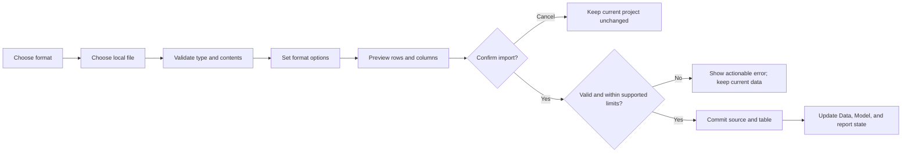

# Functionality Implementation Roadmap

This is a local data and report workflow roadmap. First finish **Home → Get data → File**; then complete the rest of Home and proceed through the other ribbon tabs. Build and finish one user workflow at a time. It does not promise that every connector or cloud command will become active.

Keep the established ribbon and Visualizations pane layout while adding behavior. Excel import remains supported. Existing connector entries can remain visible with their current staged/unavailable status; this roadmap does not add service integrations. Copilot and Power Automate are excluded throughout. A control should look available only when its workflow works end to end; apply that rule in the ribbon, menus, picker, and shortcut surfaces.

## 1. Current baseline

These items already work in the current app:

- Import CSV and Excel `.xlsx`/`.xlsm` files. Excel currently imports the first worksheet without asking which sheet to use.
- Show the loaded source in Data and Model, with a 500-row Data view preview; refresh a linked file; save and reopen `.npa` projects.
- Use New/Open/Save/Save As, add a report page, switch the supported revenue charts between bar/column/line, and use the core pane and zoom controls.

These visible entries are staged or incomplete:

- JSON, XML, Folder, PDF, and Parquet file import.
- Enter data, sample data, and Transform data.
- Generic visual authoring, text boxes, shapes, buttons, calculations, relationships, and most Optimize actions.
- Database and online/service connectors. Their presence in a catalog or ribbon does not mean they connect.

The current runtime loads one active table at a time. `.npa` files link to external data paths and store model metadata; they do not embed imported rows. The import code reads the full file into memory, so the 500-row preview limit is not a file-size limit.

## 2. Define the file import behavior

The **File connector category** under **Home → Get data** is the first implementation milestone. It is separate from **Insert → More visuals → From my files**, which is for visual assets.

Use this flow for each supported tabular format:

Do not change the loaded project while a file is being selected, configured, or previewed. Parse into a temporary candidate to build the preview, but do not commit it yet. The final import confirmation should include a warning that the current table will be replaced when one is loaded; do not ask for replacement a second time. Commit only after validation and confirmation. Cancel, unsupported types, permission errors, corrupt files, empty inputs, and parse failures must preserve the current rows, source, model, report values, and dirty state.

### Step 2.1 — Make file routing explicit

The current generic picker treats every non-CSV suffix as Excel. Replace that fallback with an explicit extension/type allowlist. Unknown extensions, wrong file contents, and legacy `.xls` must show a clear unsupported-format message; they must never reach the Excel parser.

Keep current support labeled accurately while work proceeds:

| Format | Current state | From Files v1 behavior |
|---|---|---|
| Text/CSV | Working | Preview delimiter, encoding, and header choice; preserve quoted separators and newlines; handle BOM, blank/duplicate headers, uneven rows, and empty files predictably. |
| Excel `.xlsx` / `.xlsm` | Working, first sheet only | Let the user choose one worksheet and its header row. Show a preview before import. Never execute macros. Use stored cached formula values; if a formula has no cached value, import it as blank and explain that Analytics Studio does not recalculate formulas. |
| JSON | Catalog entry only | Accept a top-level array of flat objects with scalar values. Use a deterministic column order; reject nested objects/arrays with an actionable message. |
| XML | Catalog entry only | Accept one unambiguous repeated record collection with scalar child fields. Reject mixed or irregular structures clearly. |
| Parquet | Catalog entry only | Defer until reader dependency, packaging, and number/date/null type behavior are decided. |
| Folder | Catalog entry only | Defer until combine rules, schema mismatch handling, provenance, refresh, and partial failure behavior are defined. |
| PDF | Catalog entry only | Treat as a separate document/table extraction feature; define page selection, extraction confidence, and OCR scope first. |
| Legacy `.xls` | Unsupported | Add only after choosing and packaging a parser deliberately. |

JSON and XML support above is planned, not implemented today. Keep them disabled or clearly marked unavailable until their parsers pass the same import gate as CSV and Excel. Do the same for every deferred format and every ribbon/menu shortcut that reaches a staged connector.

### Step 2.2 — Build the common preview and commit path

1. Route a selected format to its parser. Keep format-specific options in the file dialog: CSV delimiter/encoding/header settings, Excel worksheet/header settings, and any JSON/XML selection required by their bounded v1 shapes.
2. Show a bounded preview and accurate row/column counts. Normalize blank or duplicate headers deterministically and use the same null/value rules across parsers.
3. Validate the complete candidate before replacing the active table. Show useful errors that identify the file and the problem.
4. If a table is already loaded, include the replacement warning in the final import confirmation. Declining it leaves the loaded project untouched.
5. On success, update the active source and table once, then refresh the Data view, Model view, fields, and supported report summaries.

V1 has one active tabular table. It does not imply joins or simultaneous loaded tables. Persist an explicit active source identifier so a project with older source metadata reopens the same active file deterministically. For an older project that has multiple supported file sources and no active identifier, default to the first supported file source (matching the current open behavior), then persist the selected ID on save. Keep inactive metadata clearly separate from the active table. Persist parser options such as the selected worksheet and header row so refresh reproduces the same table shape. Keep the existing external-path behavior and handle Save As, missing paths, and re-import clearly.

Before calling imports ready for general file sizes, measure a practical supported limit on the minimum supported Mac and enforce it. If parsing above that limit blocks the window, move the work off the UI thread and show progress/cancel. Do not silently truncate imported data; 500 rows is only the current on-screen preview cap.

### Step 2.3 — Pass the From Files v1 gate

Complete these checks separately for CSV, Excel, JSON, and XML before beginning the Home feature work:

1. Select a representative file, preview the same rows/columns that will be imported, confirm, and see the data in Data and Model.
2. Cover format edge cases: CSV BOM/quoting/headers/uneven rows; multiple Excel sheets, blank sheets, dates, booleans, and formulas; JSON/XML supported and rejected shapes.
3. Save the project, close it, reopen it, and confirm the same source and parser options restore. Refresh after the linked file changes and confirm the table updates correctly.
4. Cover Save As for relative and absolute source paths, missing files, re-import, corrupt/empty files, unknown suffixes, permissions, and size-limit rejection.
5. Confirm cancellation or any failure leaves the last good source, table, report, and dirty state unchanged.
6. Check all UI entry points. Only formats with working importers may look enabled; staged entries must explain their unavailable state.

**From Files v1 is done** when all four declared formats pass this lifecycle gate and the deferred formats are visibly unavailable. The format list is deliberately bounded; this does not claim every file-related catalog entry works.

## 3. Complete Home

Implement Home in this order so each step reuses the tested import path.

### Step 3.1 — Finish Home’s data commands

1. Route **Get data** and the Excel shortcut through the common importer and show the correct format status.
2. Make **Recent sources** a real recent-file list with deterministic reopen behavior. Keep recent history distinct from the one active table.
3. Make **Refresh** dispatch by the active source kind and preserve last-good data when a refresh fails.
4. Add **Enter data** as an editable, validated grid. Add **Sample data** with a deterministic built-in dataset.
5. Before enabling Enter/Sample data, define how inline rows and columns are stored in `.npa`. This requires a documented project format change and migration behavior because version 1 stores source paths and table metadata, not rows. Inline sources replace the active table like file imports; Refresh is unavailable for them.

### Step 3.2 — Add data transformation

Start with a small local transformation workflow: rename/remove columns, choose data types, filter/sort rows, and remove empty/error rows. Show a preview and a list of applied steps. Save those steps with the project and replay them on refresh. Add operations one at a time and keep the source file unchanged.

Do not mark **Transform data** active until opening, applying, canceling, saving, reopening, and refreshing a transformation all behave correctly.

### Step 3.3 — Finish Home report actions

1. Replace fixed-only **New visual** behavior with a visual chooser that uses imported fields. Start with the already supported bar, column, and line charts.
2. Add per-visual field wells, selection, and edit/remove behavior. Keep missing or incompatible fields visible as a clear empty state.
3. Implement clipboard actions and Format painter against selected report objects.
4. Add text boxes and any remaining local authoring commands. Defer marketplace or service backed visual installs.
5. Add measures and quick calculations after column types and aggregation rules are stable; persist expressions and results with the model.

Sensitivity labeling, cloud publishing/sharing, and service connectors are outside this roadmap and remain unavailable. Do not add Copilot or Power Automate back through another ribbon surface.

**Home is done** when each in-scope local Home command completes its real workflow, saves/reopens where applicable, and has a clear disabled/unavailable state otherwise.

## 4. Continue through the remaining tabs and views

The ribbon tabs are File, Home, Insert, Modeling, View, Optimize, and Help. Report, Data, and Model are workspace views, not ribbon tabs. File/project save and Help basics already work; extend them only where listed below.

### Step 4.1 — Insert

Build on the saved report-object model from Home. Preserve the working Add page action, then complete page rename/delete and visual lifecycle. Add selectable/resizable text boxes, images, shapes, and buttons. Add More visuals only after a local install/import and compatibility story exists. Every object should remain selectable and editable after save/reopen.

### Step 4.2 — Data and Model workspace views

Improve the Data view for field search, column/type inspection, and reliable table preview. Then expand the project model to multiple tables if relationships are in scope. The current one-active-table limit cannot support meaningful relationships; decide source IDs, active table selection, missing-file behavior, and any project format migration before enabling them.

### Step 4.3 — Modeling

Add model table/column properties and type correction first. Add relationship creation and validation after multi-table behavior. Add date tables, calculated columns/tables, DAX measures, parameters, and security only after the type system, formula behavior, persistence, and error reporting are defined.

### Step 4.4 — View

Keep existing pane toggles, reset layout, and zoom behavior stable. Add themes, gridlines, snap-to-grid, object locking, mobile layout, and other page options only when the canvas supports and persists them. Preserve the reference side panel geometry and prevent ribbon/pane text or icons from clipping.

### Step 4.5 — Optimize

After visual rendering and data refresh are stable, add visual query pause/refresh, performance analysis, optimization presets, and slicer apply behavior. Show measurements and errors from real work; do not make these controls decorative.

### Step 4.6 — File and Help follow-up

Keep project New/Open/Save/Save As and the current About, shortcuts, and project-format help working. Decide local export formats separately. External publishing/sharing and service connectors are outside this roadmap and remain unavailable.

## 5. Implementation touchpoints

Use the existing files first; add modules only when a real responsibility needs its own home:

- `analytics_studio/data_sources.py` — supported formats and honest catalog status.
- `analytics_studio/qml/GetDataDialog.qml` — file selection, format options, preview, and confirmation.
- `analytics_studio/controller.py` — strict dispatch, parser calls, staged commit, recent/refresh behavior.
- `analytics_studio/project.py` and `docs/project-format.md` — active source identity, parser options, and any schema migration.
- `analytics_studio/qml/Main.qml` and `analytics_studio/qml/RibbonPopupMenu.qml` — route every ribbon/menu shortcut to the same real action or a clearly unavailable state.

Add parser tests and workflow tests as each feature is implemented.
